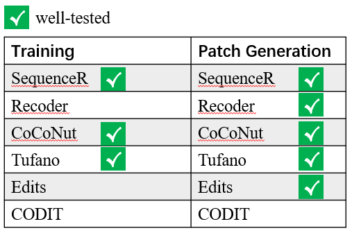
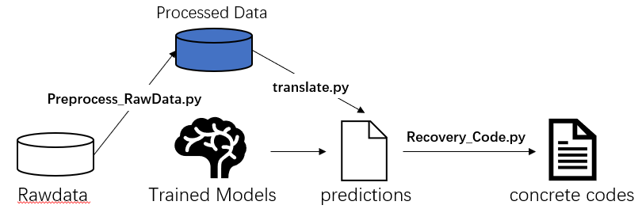

## NPR4J-Framework
### Features

### Overall Procedure

### Install Prerequirement
> pip install bson pymongo h5py javalang nltk torch transformers
### Data Preprocess
Processing data into forms that each NPR system needs
>Preprocess_RawData.py

Before data preprocessing, you need to prepare your data into a filedir including:
>|---data_dir   
&#8194;&#8194;&#8194;|---data.ids: each line has a id to identify data samples  
&#8194;&#8194;&#8194;|---buggy_lines: each file contains the buggy line of a sample    
&#8194;&#8194;&#8194;|---buggy_methods: each file contains the buggy method of a sample      
&#8194;&#8194;&#8194;|---buggy_classes: each file contains the buggy class of a sample  
&#8194;&#8194;&#8194;|---fix_lines: each file contains the developer patch line of a sample   
&#8194;&#8194;&#8194;|---fix_methods: each file contains the developer patch method of a sample    
&#8194;&#8194;&#8194;|---fix_classes: each file contains the developer patch class of a sample      
&#8194;&#8194;&#8194;|---metas: meta information of data samples

Raw data of NPR4J-Benchmark can be downloaded from this link: https://drive.google.com/drive/folders/1vKyABQbdvH8SuQc23VihB2INj_brrdnv?usp=sharing

  
### Training
To train a NPR system, you can use a simple command like this:
>python train.py -model NPR_SYSTEM_NAME -config CONFIG_FILE_PATH  

### Generating Patches
To use a trained NPR system to generate patches, you can use a simple command like this:
>python translate.py -model NPR_SYSTEM_NAME -config CONFIG_FILE_PATH  

### Resources of trained NPR systems
Trained NPR models can be downloaded from this link: https://drive.google.com/drive/folders/18WmVJQwAOmcbudgHK839KYfY98JKVrEH?usp=sharing
### GPU memory requirements for each NPR model (with tuned hyperparameters in our experiment)
SequenceR: 20GB for training, less than 10GB for predicting  
Recoder: 40GB for training, 20GB for predicting  
CODIT:  less than 10GB for training and predicting  
Edits: less than 10GB for training and predicting  
CoCoNut (singleton mode): less than 10GB for training and predicting  
Tufano: less than 10GB for trainging and predicting  

## Experiment Results for Standup4NPR (accepted by ASE 22)
>1. Evaluation_Results.zip: concrete evaluation results of every candidate predicted by the six NPR systems.  
|---Evaluation_Result   
&#8194;&#8194;&#8194;|---Diversity  
&#8194;&#8194;&#8194;&#8194;&#8194;&#8194;|---Main    
&#8194;&#8194;&#8194;&#8194;&#8194;&#8194;|---Bugs.jar      
&#8194;&#8194;&#8194;|---Empirical  
&#8194;&#8194;&#8194;&#8194;&#8194;&#8194;|---Defects4J    
&#8194;&#8194;&#8194;&#8194;&#8194;&#8194;|---Bears    
&#8194;&#8194;&#8194;&#8194;&#8194;&#8194;|---QuixBugs      
&#8194;&#8194;&#8194;&#8194;&#8194;&#8194;|---Manual_Check: manual check results of plausible/correct patches
___