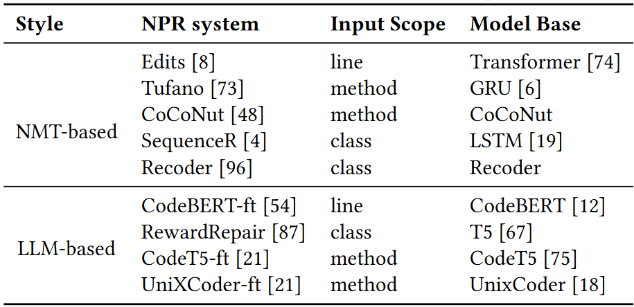

## NPR4J-Framework
### Supported NPR systems

### List of implemented papers
#### >NMT-based

[Zhu, Qihao, et al. "A syntax-guided edit decoder for neural program repair." Proceedings of the 29th ACM Joint Meeting on European Software Engineering Conference and Symposium on the Foundations of Software Engineering. 2021.](https://dl.acm.org/doi/10.1145/3468264.3468544)

[Lutellier, Thibaud, et al. "Coconut: combining context-aware neural translation models using ensemble for program repair." Proceedings of the 29th ACM SIGSOFT international symposium on software testing and analysis. 2020.](https://dl.acm.org/doi/10.1145/3395363.3397369)

[Ding, Yangruibo, et al. "Patching as translation: the data and the metaphor." 2020 35th IEEE/ACM International Conference on Automated Software Engineering (ASE). IEEE, 2020.](https://dl.acm.org/doi/10.1145/3324884.3416587)

[Chen, Zimin, et al. "Sequencer: Sequence-to-sequence learning for end-to-end program repair." IEEE Transactions on Software Engineering 47.9 (2019): 1943-1959.](https://ieeexplore.ieee.org/document/8827954/)

[Chakraborty, Saikat, et al. "Codit: Code editing with tree-based neural models." IEEE Transactions on Software Engineering (2020).](https://ieeexplore.ieee.org/document/9181462/)

[Tufano, Michele, et al. "An empirical study on learning bug-fixing patches in the wild via neural machine translation." ACM Transactions on Software Engineering and Methodology (TOSEM) 28.4 (2019): 1-29.](https://dl.acm.org/doi/10.1145/3340544)

#### >Open-Source-LLM-based

[Mashhadi, Ehsan, and Hadi Hemmati. "Applying codebert for automated program repair of java simple bugs." 2021 IEEE/ACM 18th International Conference on Mining Software Repositories (MSR). IEEE, 2021.](https://ieeexplore.ieee.org/document/9463106/)

[He Ye, Matias Martinez, and Martin Monperrus. 2022. Neural Program Repair with Execution-based Backpropagation. In 44th IEEE/ACM 44th International Conference on Software Engineering, ICSE 2022, Pittsburgh, PA, USA, May 25-27, 2022. ACM, 1506–1518.](https://ieeexplore.ieee.org/document/9793856)

[Kai Huang, Xiangxin Meng, Jian Zhang, Yang Liu, Wenjie Wang, Shuhao Li, and Yuqing Zhang. 2023. An Empirical
Study on Fine-Tuning Large Language Models of Code for Automated Program Repair. In 38th IEEE/ACM International
Conference on Automated Software Engineering, ASE 2023, Luxembourg, September 11-15, 2023. IEEE, 1162–1174. ](https://ieeexplore.ieee.org/document/10298532/)

### A light NPR-execution Framework
https://github.com/kwz219/NPR-Exec 

### Overall Procedure

### Instructions for training and translateing models with NPR4J
https://docs.google.com/document/d/1EEheTmFiMcvsgvCtb5BSL4YdlxLiSReweuzqKIshCkE/edit?usp=sharing

### Install Prerequirement
> pip install bson scipy pymongo h5py javalang nltk torch transformers OpenNMT-py==2.2.0
### Data Preprocess
Processing data into forms that each NPR system needs
>Preprocess_RawData.py

Before data preprocessing, you need to prepare your data into a filedir including:
>|---data_dir   
&#8194;&#8194;&#8194;|---data.ids: each line has a id to identify data samples  
&#8194;&#8194;&#8194;|---buggy_lines: each file contains the buggy line of a sample    
&#8194;&#8194;&#8194;|---buggy_methods: each file contains the buggy method of a sample      
&#8194;&#8194;&#8194;|---buggy_classes: each file contains the buggy class of a sample  
&#8194;&#8194;&#8194;|---fix_lines: each file contains the developer patch line of a sample   
&#8194;&#8194;&#8194;|---fix_methods: each file contains the developer patch method of a sample    
&#8194;&#8194;&#8194;|---fix_classes: each file contains the developer patch class of a sample      
&#8194;&#8194;&#8194;|---metas: meta information of data samples

Raw data of NPR4J-Benchmark can be downloaded from this link: https://drive.google.com/drive/folders/1vKyABQbdvH8SuQc23VihB2INj_brrdnv?usp=sharing

  
### Training
To train a NPR system, you can use a simple command like this:
>python train.py -model NPR_SYSTEM_NAME -config CONFIG_FILE_PATH  

### Generating Patches
To use a trained NPR system to generate patches, you can use a simple command like this:
>python translate.py -model NPR_SYSTEM_NAME -config CONFIG_FILE_PATH  

### Resources of trained NPR systems
Trained NPR models can be downloaded from this link: https://drive.google.com/drive/folders/18WmVJQwAOmcbudgHK839KYfY98JKVrEH?usp=sharing
### GPU memory requirements for each NPR model (with tuned hyperparameters in our experiment)
SequenceR: 20GB for training, less than 10GB for predicting  
Recoder: 40GB for training, 20GB for predicting  
CODIT:  less than 10GB for training and predicting  
Edits: less than 10GB for training and predicting  
CoCoNut (singleton mode): less than 10GB for training and predicting  
Tufano: less than 10GB for trainging and predicting  

##Latest Experiment Results 
> considering 9 NPR systems: (Edits, Tufano, CoCoNut, CodeBERT-ft, RewardRepair, Recoder, SequenceR, CodeBert-ft, UniXCoder-ft) 
> candidate number: up to 300  
> manual validation results 1: https://docs.google.com/spreadsheets/d/11oUYyEiMnDfHRONSrB9hY1smXcrroJSN/edit?usp=sharing&ouid=116802316915888919937&rtpof=true&sd=true
> manual validation results 2: latest_results/additional_result_check.xlsx

